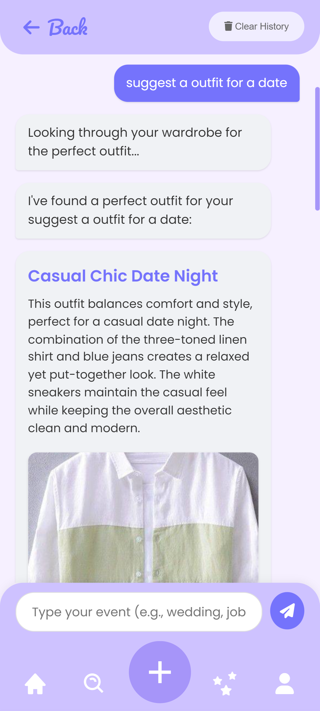
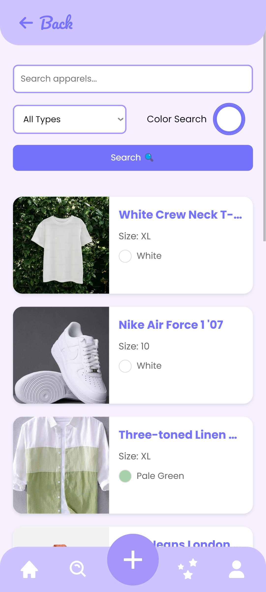
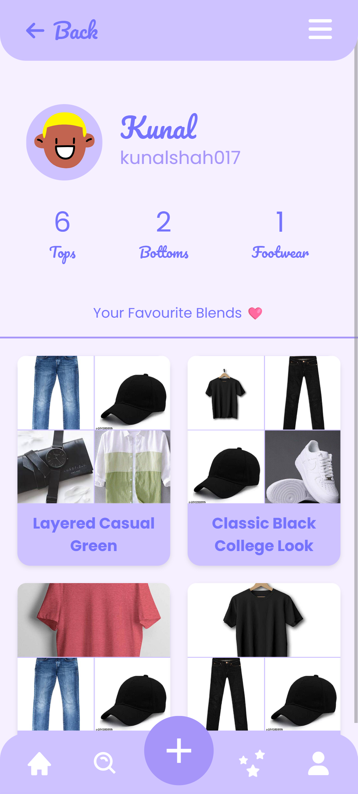
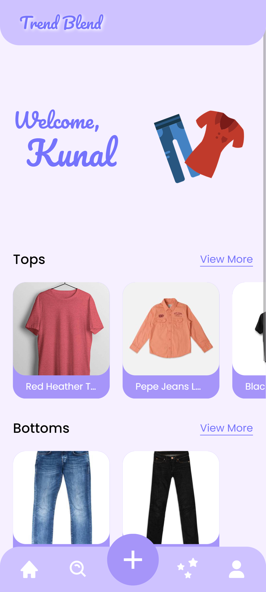

# TrendBlend 👔👗


[](https://trendblend.azurewebsites.net)
[](LICENSE)

> Your personal AI-powered virtual wardrobe assistant

TrendBlend helps you organize your clothing collection digitally and provides AI-powered outfit recommendations tailored to your style preferences.

## ✨ Features

- **Virtual Wardrobe Management** 🧥 - Digitize your entire clothing collection in one place
- **AI-Generated Descriptions** 📝 - Get detailed apparel descriptions generated automatically
- **Smart Search Functionality** 🔍 - Find clothing items by name, type, color, and more
- **Personalized Outfit Recommendations** 👚👖 - Receive AI-powered suggestions based on your wardrobe
- **Responsive Design** 📱 - Access your wardrobe from any device

## 🚀 Deployment

Visit our live application: [trendblend.azurewebsites.net](https://trendblend.azurewebsites.net)

<p align="center">
  
  
</p>
<p align="center">
  
  
</p>

## 🛠️ Tech Stack

- **Frontend**:

  - HTML5, CSS3, JavaScript
  - Interactive UI components

- **Backend**:

  - C# (ASP.NET)
  - ASP.NET Web Services (ASMX)

- **AI & Machine Learning**:

  - Gemini 2.0 Flash model for clothing recognition
  - Natural language processing for apparel descriptions

- **Database**:

  - Structured data storage for user wardrobes
  - Fast query capabilities for search functionality

- **CDN**:

  - Cloudinary for image storage and delivery

- **Deployment**:
  - Azure App Services
  - Azure SQL Databases

## 📋 Getting Started

### Prerequisites for Self Host

- .NET SDK 4.0
- Visual Studio 2022 or preferred IDE
- Azure account (for deployment)
- Cloudinary API for CDN
- Gemini API for AI

### Installation

1. Clone the repository

   ```bash
   git clone https://github.com/kunalshah017/trendblend.git
   cd trendblend
   ```

2. Open the project via SLN file in Visual Studio

3. Create 2 Files in root of Project `db.config` & `env.config` with below templates

   - **db.config**
     ```xml
     <?xml version="1.0" encoding="utf-8" ?>
      <connectionStrings>
         <add name="Your DB Name" connectionString="Your DB Connection String till Password" providerName="System.Data.SqlClient" />
      </connectionStrings>
     ```
   - **env.config**
     ```xml
      <appSettings>
      	<add key="PasswordSalt" value="Your random password salt" />
      	<add key="CloudinaryCloud" value="Your Cloudinary Cloud Name" />
      	<add key="CloudinaryApiKey" value="Your Cloudinary API key" />
      	<add key="CloudinaryApiSecret" value="Your Cloudinary API Secret" />
      	<add key="ValidationSettings:UnobtrusiveValidationMode" value="None" />
      	<add key="GeminiApiKey" value="Your Google Gemini API key" />
      </appSettings>
     ```

4. Recreate Database Schema
   1. Get Server Name of your Azure SQL Database or Local DB
   2. Connect to it via [SQL Server Management Studio(SSMS)](https://docs.microsoft.com/en-us/sql/ssms/download-sql-server-management-studio-ssms?view=sql-server-ver16)
   3. Once you are on your desired database
      1. Select `File` Option from top menu
      2. Select `Open` Option
      3. Select `File`
      4. Open `schema.sql` file from TrendBlend project
      5. Click `f5` or `Execute` option to execute the script
   
5. Run the project in Debug Mode
6. Open your browser and navigate to `http://localhost:51368`

## 👥 Contributors

Thanks to all the amazing people who have contributed to this project:

[](https://github.com/kunalshah017/TrendBlend)

## 🤝 Contributing

We welcome contributions to TrendBlend! Here's how you can help:

1. **Fork the repository**
2. **Create a feature branch**
   ```bash
   git checkout -b feature/amazing-feature
   ```
3. **Commit your changes**
   ```bash
   git commit -m 'Add some amazing feature'
   ```
4. **Push to the branch**
   ```bash
   git push origin feature/amazing-feature
   ```
5. **Open a Pull Request**

### Contribution Guidelines

- Follow the existing code style and conventions
- Write clear, descriptive commit messages
- Add tests for new features
- Update documentation as needed
- Be respectful and constructive in discussions

## 📄 License

This project is licensed under the MIT License - see the [LICENSE](LICENSE) file for details.

## 📞 Contact

Have questions or suggestions? Reach out to us:

- Email: [contact.kunalshah017@gmail.com](mailto:contact.kunalshah017@gmail.com)
- GitHub Issues: [Report a bug](https://github.com/kunalshah017/trendblend/issues)

---

<p align="center">Made with ❤️ by the TrendBlend Team</p>
